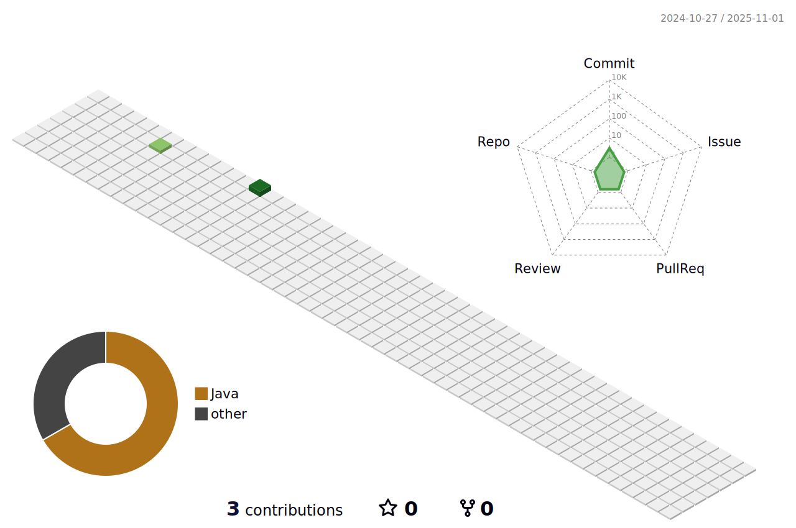

	<h4>🎨 Portfolio & Blog 🎨</h4>

	
		
	
	 

 

	<h3>📚 Tech Stack 📚</h3>

	
	
	
	 
	 
	
		
	
	 
	
	
	
	
	  
	 
	  
	 
	 
	 
	   
	

	 

	 

	 

 
<h4>🏆 Baekjoon solved rank 🏆</h4>
	

	<h4> 🌱 Let Me Show my GitHub activity details! 🌱 </h4>

  
